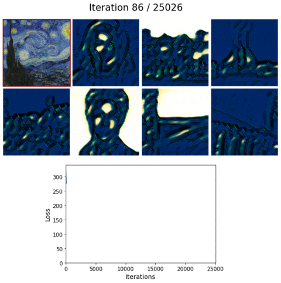
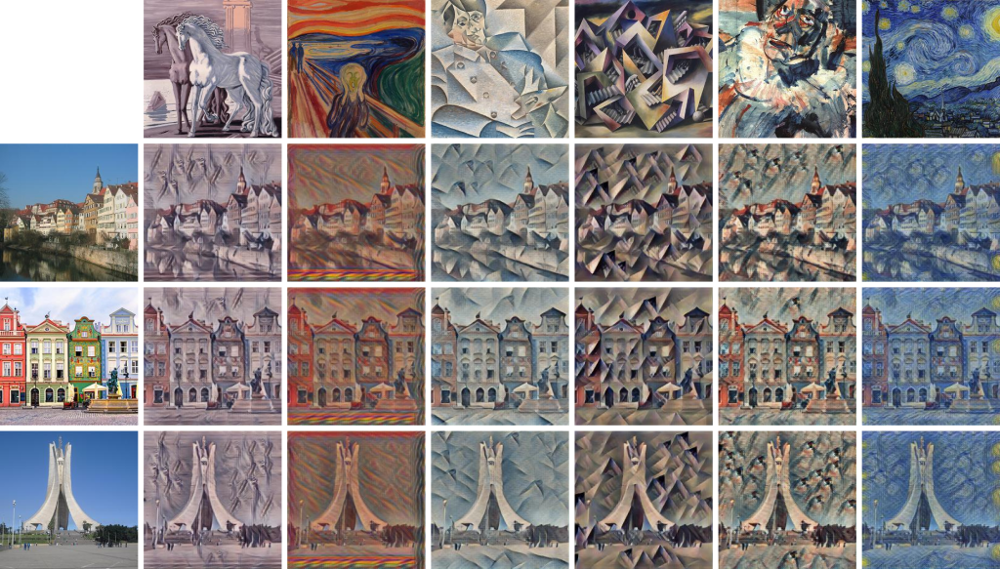
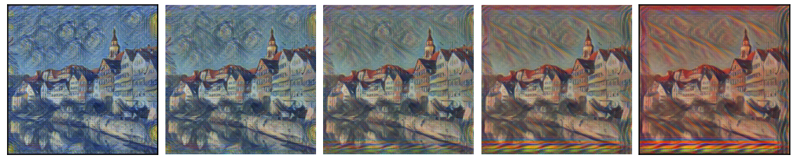
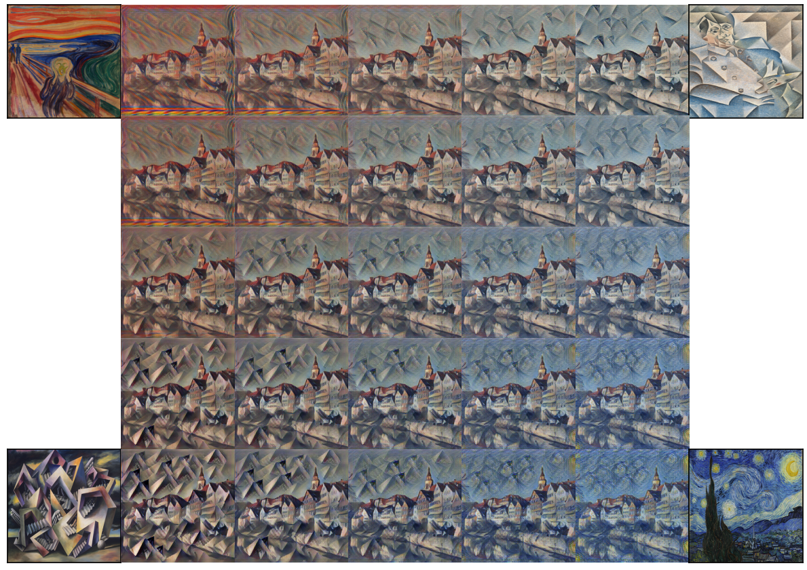

# Faster Style Transfer

> An unofficial, from scratch implementation using the PyTorch framework of the paper "A Learned Representation for Artistic Style" realized in 2016 by Google Brain.

[](https://colab.research.google.com/drive/1ohRwevCluPZFXcA7QicdZGIgtRSWiDQl)

## General Info

This project implements a style transfer technique, which involves repainting an input image by following some artistic drawing style. The adopted approach has gradually improved to the benefit of reducing processing time and required memory capacity. The three major improvements can be broadly summarized as follows:

- The original style transfer, "A Neural Algorithm of Artistic Style" ([paper](https://arxiv.org/abs/1508.06576), [code](https://github.com/jcjohnson/neural-style)), used a pre-trained CNN VGG-19 network to extract features from 3 types of images: style (artistic drawing), content (input image to be stylized) and synthesized image (the output). The latter, initially containing only noise, is modified by gradient descent so that it will be close to both style and content images. Although very flexible, this algorithm was slow due to its repetitive processing steps. An implementation of this algorithm is available in my Stanford CS231n assignments solutions [repository](https://github.com/seloufian/Deep-Learning-Computer-Vision)'s [notebook](https://github.com/seloufian/Deep-Learning-Computer-Vision/blob/master/cs231n/assignment3/StyleTransfer-PyTorch.ipynb).

- A fast version, "Perceptual Losses for Real-Time Style Transfer" ([paper](https://arxiv.org/abs/1603.08155), [code](https://github.com/jcjohnson/fast-neural-style)), used to train a style transfer network for the style application, which resulted in an incomparable inference speed gain over the original algorithm. However, there was a major drawback: each style had its network, which required a significant memory capacity.

- A **faster style transfer** version (current project implementation) uses a single network trained on all styles. This algorithm offers relatively low memory usage (in drive and RAM) and faster processing by loading only a single pre-trained model.

The [official implementation](https://github.com/magenta/magenta/tree/main/magenta/models/image_stylization) was made using the TensorFlow framework. Although detailed and complete, some difficulties may be encountered when diving into and attempting to follow and understand a such code. For that, in this project, the PyTorch framework was used with -hopefully- simpler modules definitions and more detailed code comments.

This project is a reimplementation of the style transfer technique from scratch. Starting with model definition (component modules: layers, loss function, dataset and other helper functions), through model training and hyperparameters tuning, and ending with model evaluation, obtained results presentation and description. During development, even though the paper is clear and well-written, some parts were not detailed enough (with referenced papers check included), and therefore, some lookups on the official implementation were necessary to demystify the fuzzy parts.

The project is an unofficial implementation, made mainly for learning purposes. For this, the given code and some processing steps may differ from the original implementation and use other experience-based parameters.

## Project Content

To be fully functional, for practical considerations, this project is divided into two complementary parts:

- The current repository: for storing the code, explain and present obtained results.

```text
.
├── faster_style_transfer         <- Project's style transfer package
│   ├── model                     <- Contains model network's elements definition
│   │   ├── dataset.py            <- Dataset handler for the style transfer module
│   │   ├── layers.py             <- Used modules (layers) in the style transfer network
│   │   ├── loss_functions.py     <- Loss functions for the feature extraction network
│   │   ├── module.py             <- Style transfer module
│   │   ├── network.py            <- Style transfer network
│   │   └── perceptual_network.py <- Feature extraction network
│   └── process                   <- Contains model processing functions
│       ├── build_model.py        <- Network build function
│       ├── predict.py            <- Network prediction/evaluation function
│       ├── train.py              <- Network training function
│       └── utils.py              <- Helper functions for model training/evaluation
├── images                        <- Contains obtained results' illustrations
├── images_stylization.ipynb      <- Images stylization demo notebook
├── README.md, LICENSE.md         <- Current project info and license
└── requirements.txt              <- Required Python packages
```

- A Google [Drive directory](https://drive.google.com/drive/folders/1F8Cxvv5VfbtxetC4ABmAd_GaCYjhdNRR): for storing data, such as images and model checkpoint files.

```text
.
├── model                 <- Contains required data for model functioning
│   ├── checkpoints       <- Checkpoints for model training resume or evaluation
│   └── styles            <- Resized style paintings (for model training/evaluation)
├── images                <- Contains supplementary/optional images
│   ├── notebook          <- Embedded images in the stylization demo notebook
│   ├── orignal_styles    <- Style painting with original size
│   └── test              <- Contains test images
│       ├── resized       <- Resized test images (for model evaluation)
│       └── original      <- Test images with original size
└── info.txt              <- Current Drive info
```

## Usage

To get the project application ready to use, follow the guideline steps below:

1. Clone the repository, create a virtual environment and install the requirements.

```bash
# Clone the project repository.
git clone https://github.com/seloufian/Deep-Learning-Computer-Vision.git

# Change directory to the project repository.
cd Deep-Learning-Computer-Vision-Main

# Optionally, create a Python virtual environment and activate it.
python -m venv venv-style-transfer
source venv-style-transfer/bin/activate

# Install project requirements.
pip install -r requirements.txt
```

2. Download the style images and the latest checkpoint file.

```bash
# Get the style images.
gdown --folder '1CuKmsxpB7IH_1BdxJBYn0wx1oivJ9XqL' -O 'data_style_transfer/'

# Get the Style Transfer model checkpoint (weights).
# Checkpoint filename: checkpoint_25026.tar
gdown '1-ogTIuMNZ1XJj7rV_ckN80HrYTyYEBok' -O 'data_style_transfer/'
```

Next, depending on the chosen task, consider one of the following guidelines:

- For model training: download the [COCO](https://cocodataset.org/#home) 2017 [dataset](https://cocodataset.org/#download) train images and structure it appropriately.

```bash
# Get the COCO 2017 dataset train images (18 GB).
wget 'http://images.cocodataset.org/zips/train2017.zip'

# Uncompress the dataset.
unzip -q 'train2017.zip'

# Optionally, to preserve disk space, remove the compressed dataset file.
rm 'train2017.zip'
```

To train the model or resume its training from a specific checkpoint, use the [``build_model``](faster_style_transfer/process/build_model.py) and [``train``](faster_style_transfer/process/train.py) functions.

```python
import torch

from faster_style_transfer.process import build_model, train


device = 'cuda' if torch.cuda.is_available() else 'cpu'

# Build the model and restore its weights from the checkpoint file.
model = build_model(
    style_path='data_style_transfer/styles/',
    mode='train',
    content_path='train2017/',
    checkpoint_path='data_style_transfer/checkpoint_25026.tar',
    device=device
)

# Continue model's training from the 25,026-th iteration.
train(
    model=model,
    save_dir_path='train_checkpoints/',
    max_iterations=30000
)
```

- For model evaluation/inference: optionally, download the test images.

```bash
# Get the test images.
gdown --folder '17s4zl1AFd4MP81_0pdzXJVWyQrVOpDN6' -O 'data_style_transfer/test/'
```

To evaluate the model, use the [``build_model``](faster_style_transfer/process/build_model.py) and [``predict``](faster_style_transfer/process/predict.py) functions.

```python
import torch

from faster_style_transfer.process import build_model, predict


device = 'cuda' if torch.cuda.is_available() else 'cpu'

# Build the model and restore its weights from the checkpoint file.
model = build_model(
    style_path='data_style_transfer/styles/',
    checkpoint_path='data_style_transfer/checkpoint_25026.tar',
    device=device
)

out_image = predict(model,
    content_images_path='data_style_transfer/test/resized/tubingen.jpg',
    # Styles are identified by their index from 0 to 11.
    # Selected style: The Starry Night.
    style_index=11
)

out_image[0]
```

To show model capabilities, consider the *Faster Images Stylization* notebook: [locally](images_stylization.ipynb) or on [Google Colab](https://colab.research.google.com/drive/1ohRwevCluPZFXcA7QicdZGIgtRSWiDQl).

## Training

Model building and training was done on the freely available cloud platforms that offer free GPUs, [Google Colab](https://colab.research.google.com/) for development and [Kaggle](https://www.kaggle.com/) kernels for experimentation and hyperparameters tuning, as it offers continuous background runtime for [12 hours](https://www.kaggle.com/docs/notebooks#technical-specifications).

Due to limited resources, some adjustments were needed to fit the model into memory and train it in a reasonable amount of time:

- The stylized image output was changed from 512 x 512 x 3 (width x height x RGB channels) to 256 x 256 x 3.
- The training dataset was changed from [ImageNet](https://www.image-net.org/) to [COCO](https://cocodataset.org/#home) 2017 dataset.
- The number of training loop iterations was changed from 40,000 to 25,000.
- The number of artistic style images was changed from 32 to 12 (available on the project's [Drive](https://drive.google.com/drive/folders/1CuKmsxpB7IH_1BdxJBYn0wx1oivJ9XqL)).

As a reference, training the model from scratch, on 12 style images, using the best-obtained hyperparameters (after experimentation), for 25,000 iterations, on the Nvidia P100 GPU (with 16 GB of memory) took approximately **73 hours**.

The illustration below shows the learning progress for *"The Starry Night"* style image.

<p align="center">
    
</p>

## Results

Thanks to its architectural design, which is based on training a single model on multiple paintings, the project model can perform two stylization types:

- **Single Image Stylization**: the basic option. Applies a single painting on the input image. The illustration below shows the results obtained by applying 6 styles to 3 different images.

<p align="center">
    
</p>

- **Weighted Image Stylization**: Combines multiple (at least 2) paintings to form the stylized image. It consists of associating a weight (from 0.0 to 1.0) for each combination's painting to form a convex combination, so the weights sum to 1. The two illustrations below show a smooth transition of stylized image between the paintings.

<p align="center">
    
    
</p>

## Credits and License

This project is distributed under the [``MIT license``](LICENSE.md). Credits belong to the paper authors cited below.

```text
@article{dumoulin2016learned,
  title={A learned representation for artistic style},
  author={Dumoulin, Vincent and Shlens, Jonathon and Kudlur, Manjunath},
  journal={arXiv preprint arXiv:1610.07629},
  year={2016}
}
```
